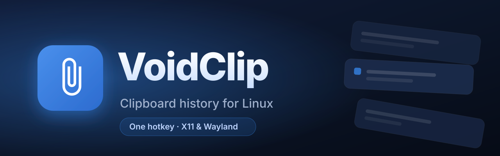

<div align="center">



[](LICENSE)
[](https://github.com/akashmahedy/VoidClip/releases)


[Features](#-features) • [Install](#-install) • [Usage](#-usage) • [Contributing](#-contributing)

</div>

## What it is

VoidClip keeps a searchable history of what you copy — plain text, HTML, and images — and brings it back with one keypress. It is a native C++23 app with a GTK4 + libadwaita UI, rewritten from an earlier Python/PyQt6 version.

The picker is designed for keyboard use: open it, type to search, move with the arrow keys, then copy or paste without reaching for the mouse. Clipboard history stays on your computer; VoidClip sends no install or usage telemetry.

Linux Mint 22 XFCE/X11 is a first-class target. VoidClip registers its global shortcut directly through Xfconf, while GNOME keeps its existing settings-daemon integration. Wayland support continues through XWayland where available.

---

## 🚀 Features

| | |
|---|---|
| 🗂️ **History** | Captures text, rich text (HTML), and images or screenshots as you copy them, newest first. |
| 🖼️ **Image thumbnails** | Copied and pasted images render as thumbnails instead of raw byte counts. |
| 📌 **Pinning** | Pin the clips you reuse so they stay at the top. |
| 🔍 **Fuzzy search** | Start typing to filter the whole history. |
| ⌨️ **Keyboard-first picker** | Use arrows, Enter, number shortcuts, Delete, and pin controls without leaving the search field. |
| 🖥️ **XFCE + GNOME shortcuts** | A configurable shortcut (default `Super+V`) is registered automatically through Xfconf or GNOME Settings. |
| 📋 **Click to paste** | Click a clip to copy it, and optionally auto-paste it into the window you came from. |
| ⚠️ **Honest failure feedback** | Shortcut and auto-paste failures stay visible, with the clip left safely on the clipboard. |
| 🛡️ **Privacy controls** | Pause recording instantly; password-manager clips carrying the KDE secret hint are ignored. |
| 🧹 **Paste as plain text** | Strip HTML formatting when pasting a rich-text entry. |
| 🌗 **Themes** | Dark, light, or follow the system. |
| 💾 **SQLite storage** | History lives in a WAL-mode SQLite database with de-duplication and a configurable size cap. |
| 🪶 **Event-driven** | Capture is signal-driven, not polled, so it idles cheaply in the background. |

---

## 📦 Install

### One-line installer

```bash
curl -fsSL https://raw.githubusercontent.com/akashmahedy/VoidClip/main/scripts/install.sh | bash
```

The script detects your distro and architecture and installs a `.deb` or `.rpm` when it can, falls back to an AppImage, and builds from source if neither fits. Release downloads are verified against published SHA-256 checksums, and the script adds VoidClip to your login autostart.

Prebuilt DEB packages target Ubuntu 24.04 / Linux Mint 22 or newer (`glibc 2.38+`). Linux Mint 21.x users should use the AppImage when available or build on their own system. Direct DEB/RPM installs include an XDG autostart entry, so they behave the same way as the installer-script path.

To remove it:

```bash
curl -fsSL https://raw.githubusercontent.com/akashmahedy/VoidClip/main/scripts/install.sh | bash -s -- --uninstall
```

### Build from source

<details>
<summary>Prerequisites and build steps</summary>

You need CMake ≥ 3.28, Ninja, a C++23 compiler, and vcpkg with `VCPKG_ROOT` exported. GTK4, libadwaita, gtkmm-4.0, Qt6, and libX11 come from your system, not vcpkg.

```bash
# Debian / Ubuntu
sudo apt install cmake ninja-build qt6-base-dev qt6-tools-dev libgl-dev \
             libx11-dev libgtkmm-4.0-dev libadwaita-1-dev
```

vcpkg pulls the rest (GoogleTest, spdlog, nlohmann-json, SQLiteCpp) from the manifest at configure time. Then:

```bash
git clone https://github.com/akashmahedy/VoidClip.git
cd VoidClip
cmake --preset release
cmake --build --preset release
```

The presets are `debug`, `release`, and `asan`.

</details>

---

## 🔑 Runtime requirements

VoidClip needs GTK4 and libadwaita at runtime. XFCE users do not need to replace their desktop or window manager; the application carries its own GTK UI.

Auto-paste writes to `/dev/uinput`, which on most systems means joining the `input` group:

```bash
sudo usermod -aG input $USER
# log out and back in for the group to take effect
```

Without `/dev/uinput` access, paste falls back to `xdotool` on X11, or `wtype`/`ydotool` on Wayland, when one is installed. On Linux Mint XFCE, installing `xdotool` is the simplest fallback. History capture and copy-only actions work either way; only paste-back depends on input injection.

If every paste method fails, VoidClip reopens with a clear message. The selected clip remains on the clipboard, ready for a manual <kbd>Ctrl</kbd>+<kbd>V</kbd>.

---

## 🛠️ Usage

Launch `VoidClip` once and it stays running in the background. Press your hotkey to toggle the window, type to fuzzy-search, and use the keyboard or mouse to choose a clip.

Open **Settings** to change the theme, rebind the hotkey, pause recording, toggle auto-paste and auto-hide-on-copy, show or hide the panel icon, and set the maximum history size.

To start hidden — for autostart entries — pass `--background`.

### Shortcuts

| Key | Action |
|---|---|
| <kbd>Super</kbd>+<kbd>V</kbd> | Toggle the VoidClip window (default; configurable) |
| <kbd>Click</kbd> | Copy the clip (and auto-paste if enabled) |
| <kbd>Ctrl</kbd>+<kbd>Click</kbd> | Pin / unpin a clip |
| Type | Fuzzy-search the history |
| <kbd>↑</kbd> / <kbd>↓</kbd> | Select the previous / next visible clip |
| <kbd>Enter</kbd> | Copy the selected clip |
| <kbd>Alt</kbd>+<kbd>Enter</kbd> | Copy and paste the selected clip |
| <kbd>Alt</kbd>+<kbd>Shift</kbd>+<kbd>Enter</kbd> | Paste the selected clip as plain text |
| <kbd>Ctrl</kbd>+<kbd>1</kbd> … <kbd>9</kbd> | Copy one of the first nine visible clips |
| <kbd>Ctrl</kbd>+<kbd>P</kbd> | Pin / unpin the selected clip |
| <kbd>Delete</kbd> | Remove the selected clip |
| <kbd>Ctrl</kbd>+<kbd>,</kbd> | Open Settings |
| <kbd>Esc</kbd> | Hide the window |

---

## 🔧 Configuration

VoidClip keeps its state under `~/.local/share/voidclip/`:

- `settings.json` — preferences
- `history.db` — the SQLite history database

New files are created with user-only permissions. Clipboard de-duplication state is kept only in memory, not in a separate plaintext cache.

Keys in `settings.json` include `theme`, `hotkey`, `max_history_items`, `auto_hide_on_copy`, `auto_paste`, `capture_paused`, and `first_run_completed`. The Settings dialog is the easier way to change them.

On the first v0.3.1 launch, an existing `~/.local/share/copyclip/` profile is moved to the VoidClip directory only when the new directory does not already exist. Existing VoidClip data is never overwritten. Individual text/rich-text payloads are capped at 4 MiB and image payloads at 25 MiB before they reach the database.

---

## 🤝 Contributing

The build is C++23 with CMake presets (`debug`/`release`/`asan`), Ninja, and vcpkg in manifest mode. `clang-format` and `clang-tidy` configs are committed, warnings are errors (`-Wall -Wextra -Wpedantic -Wconversion -Wshadow -Werror`), and a GoogleTest suite under an ASan+UBSan+LSan build gates merges. Read [CONTRIBUTING.md](CONTRIBUTING.md) for setup, the toolchain, and the commit conventions before opening a PR, and branch off `main` for feature work.

---

## 💖 Support

<div align="center">

<a href="https://buymeacoffee.com/walkercito"></a>
<a href="https://ko-fi.com/walkercito"></a>
<a href="https://www.paypal.me/KarlaMejiasArian"></a>
<a href="https://walkercitodev.vercel.app/donate"></a>

</div>

VoidClip is free and MIT-licensed. If it earns a spot in your workflow, a coffee or a ⭐ helps keep it maintained.

---

## 📄 License

MIT © 2024 Walkercito. See [LICENSE](LICENSE).

VoidClip is based on the original [CopyClip](https://github.com/Walkercito/CopyClip) project; the original copyright and MIT license are preserved.
